# 1. Ansible 소개

</br>

**Ansible**

- 오픈 소스 자동화 플랫폼

- yaml 사용 (json을 대체)

- Iac (Infrastructure As Code)

- XaC -> JCaC 

- GitOps

</br>

데이터 저장 경로

kubectl -> Api-SErcer -> ETCD -> Controller-Manager ->  Api-Server -> kubelet      

</br>

Gitflow

</br>

**Chaos Engineering**

운영 환경에서도 갑작스러운 장애를 견딜 수 있는 시스템을 구축하기 위해 시스템을 실험하는 분야

ex. Chaos Monkey (Netflix)

</br>

**Ansible**

|___제어노드

|___관리 호스트

        |___인벤토리 (관리 호스트 목록)

        |___플레이북 (실제 수행해야 하는 작업 목록/ yaml파일로 작성)


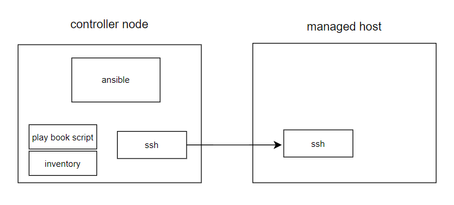


</br>

**작업이 실패하는 경우 Ansible의 기본 동작**

: 실패한 호스트에 대해 플레이북의 나머지 부분을 중단하고 나머지 호스트로 작업을 계속함

작업, 플레이 및 플레이북은 멱등(Idempotence)이 되도록 설계되어 있음

    (**멱등성: 동일한 연산을 여러 번 수행해도 결과가 달라지지 않는 성질)

즉, 동일한 호스트에서 플레이북을 안전하게 반복 실행할 수 있음

시스템이 올바른 상태에 있을 때 플레이북을 실행하면 어떠한 변경사항도 발생하지 않음

</br>

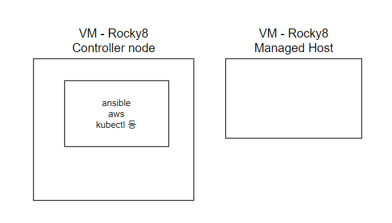

</br>

virtualbox = vmware workstaion pro

</br>

External / Internal Network

</br>

---

환경 설정

VMware, Rocky 설치

---

1. **네트워크 연결**

2. **ssh 키 생성 및 전달**

3. **inventory 설정**

</br>

</br>

### 1. 네트워크 연결

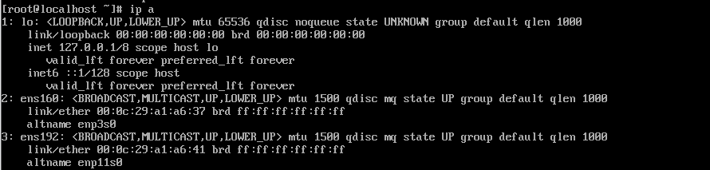

1: lo:

2: ens160 -> NAT

3: ens192 -> Host-only

</br>

ens160 활성화

`nmcli con up ens160`

</br>

nmcli: 특정 네트워크 인터페이스의 IPv4 주소를 수동으로 설정하는 데 사용

```ip
nmcli con mod ens192 \

ipv4.address 172.16.0.200/24 \

ipv4.method manual
```

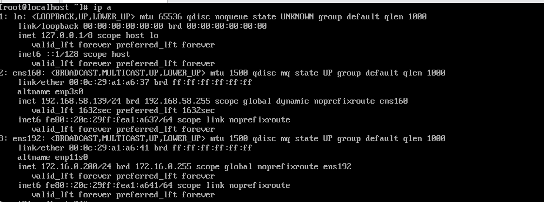

</br>

mobaXterm에서 172.16.0.200 접속

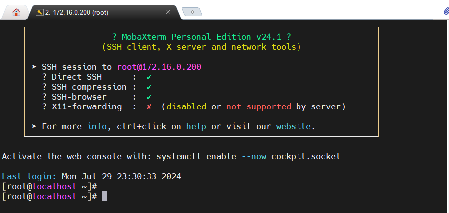

`yum install epel-release`

`yum install ansible`

</br>

모듈 정상 동작 확인

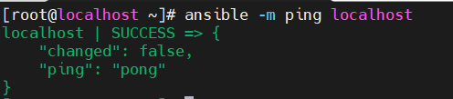

</br>

가상머신 종료

```
poweroff
```

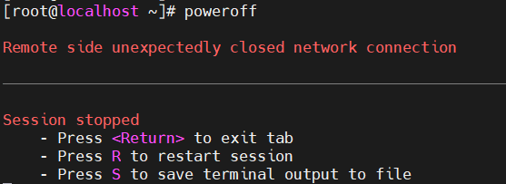

중지(suspend) 상태 => 설정 변경 불가

반드시 shut down

</br>

가상머신 복사(clone)

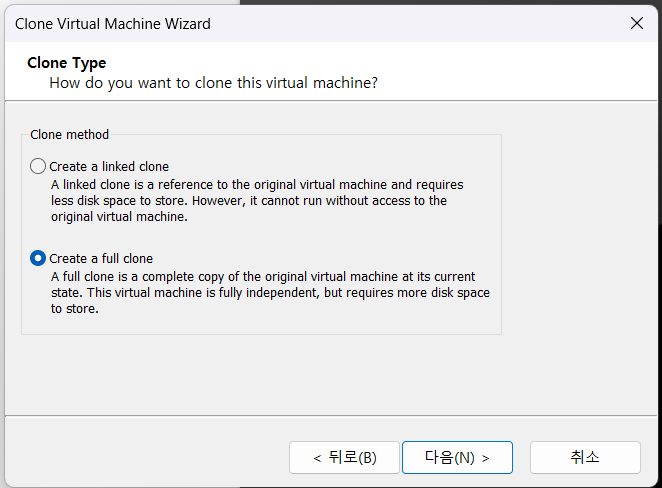

full clone 해야 원본에 영향X

</br>

**sysprep**

: 해당 시스템에만 적용되는 고유한 정보들

</br>

ip address 수동 변경

```
serverA => 172.16.0.201    
serverB => 172.16.0.202
```

```
//172.16.0.200 시스템의 호스트 이름을 controller로 변경 
hostnamectl set-hostname controller

//새로운 bash 셸 세션이 시작되며, 변경된 호스트 이름을 반영
bash
```

serverA, serverB도 이름 변경

</br>

---

### 2.ssh 키 생성 및 전달

```
//key-pair 생성
ssh-keygen
```


</br>


`cat`: 파일의 내용을 출력하는 명령어.

`.ssh/known_hosts`: SSH 접속 시 접속했던 호스트의 키가 저장된 파일.

</br>

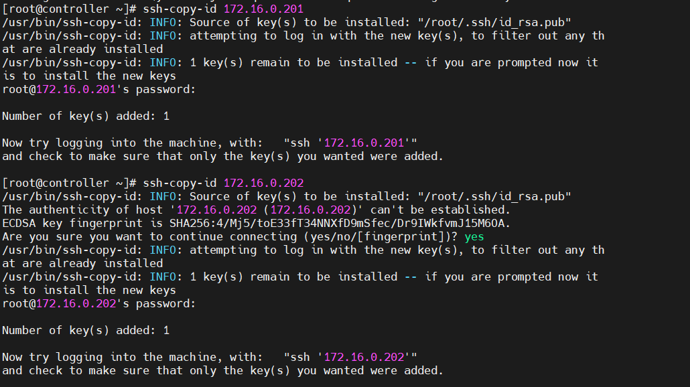

`ssh-copy-id` 명령어를 실행하여 공개 키를 원격 서버에 복사

=> ssh로 접속 시 더이상 비밀번호 물어보지 않음

---

### 3.inventory 설정

`vi inventory`


</br>

DNS (Domain Name Service)

8.8.8.8

1. cache

2. /etc/hosts

3. /etc/resolv.conf

</br>

`vi /etc/hosts`

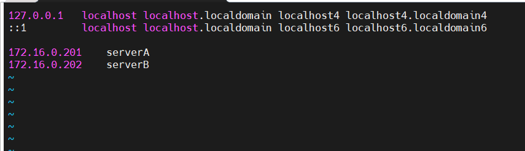

</br>

`ansible -i inventory -m ping serverA`

`ansible`: Ansible 명령어로, Ansible에서 단일 모듈을 실행하는 데 사용.

`-i inventory`: 인벤토리 파일을 지정. 인벤토리 파일은 관리 대상 호스트의 목록을 포함.

`-m ping`: `ping` 모듈을 사용. 단순히 Ansible이 대상 호스트에 접근할 수 있는지를 확인

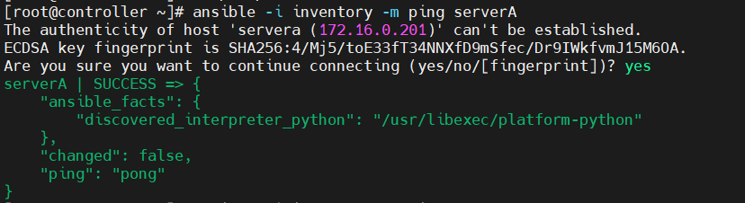

</br>
